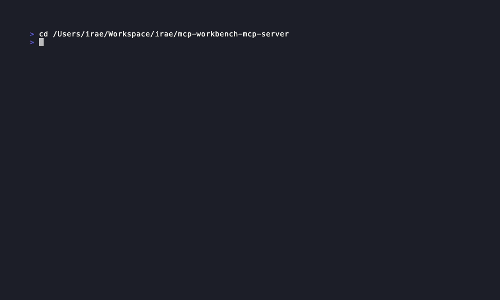

# mcp-workbench-mcp-server

Expose [MCP Workbench](https://github.com/raeseoklee/mcp-workbench) capabilities as an MCP server, so AI agents (Claude, Cursor, etc.) can inspect, test, and validate MCP servers programmatically.



## How it differs from `mcp-workbench` CLI

The `mcp-workbench` CLI is designed for human developers running commands in a terminal. This project wraps that CLI as an MCP server, so AI agents can call the same capabilities as structured tools with typed inputs and outputs.

## Prerequisites

The `mcp-workbench` CLI must be installed and available on your PATH:

```bash
npm install -g mcp-workbench
```

Or set the `MCP_WORKBENCH_CLI` environment variable to the path of the binary.

## Installation

```bash
npm install -g mcp-workbench-mcp-server
```

Or clone and build from source:

```bash
git clone https://github.com/raeseoklee/mcp-workbench-mcp-server.git
cd mcp-workbench-mcp-server
npm install
npm run build
```

## Usage

### Claude Desktop

Add to your `claude_desktop_config.json`:

```json
{
  "mcpServers": {
    "mcp-workbench": {
      "command": "mcp-workbench-server"
    }
  }
}
```

### Cursor

Add to your MCP server configuration:

```json
{
  "mcpServers": {
    "mcp-workbench": {
      "command": "mcp-workbench-server"
    }
  }
}
```

### Manual

```bash
# Run directly (stdio transport)
mcp-workbench-server

# Or via node
node dist/index.js
```

## Available Tools

### `inspect_server`

Connect to an MCP server and inspect its capabilities.

**Input:**
| Field | Type | Required | Description |
|-------|------|----------|-------------|
| `transport` | `"stdio" \| "streamable-http"` | Yes | Transport type |
| `url` | `string` | No | Server URL (required for streamable-http) |
| `command` | `string` | No | Command to launch server (required for stdio) |
| `args` | `string \| string[]` | No | Arguments for the server command |
| `headers` | `Record<string, string>` | No | HTTP headers (e.g. Authorization) |
| `timeoutMs` | `number` | No | Timeout in ms (default: 30000) |

**Output:** Server name, version, protocol version, and a capability matrix (tools, resources, prompts, completions, logging).

### `generate_spec`

Auto-generate a YAML test spec by discovering server capabilities.

**Input:**
| Field | Type | Required | Description |
|-------|------|----------|-------------|
| `transport` | `"stdio" \| "streamable-http"` | Yes | Transport type |
| `url` | `string` | No | Server URL |
| `command` | `string` | No | Server command |
| `args` | `string \| string[]` | No | Server arguments |
| `headers` | `Record<string, string>` | No | HTTP headers |
| `include` | `Array<"tools" \| "resources" \| "prompts">` | No | Only include these types |
| `exclude` | `Array<"tools" \| "resources" \| "prompts">` | No | Exclude these types |
| `depth` | `"shallow" \| "deep"` | No | Discovery depth |
| `timeoutMs` | `number` | No | Timeout in ms |

**Output:** The generated YAML spec, test count, and any warnings (e.g. TODO placeholders).

### `run_spec`

Run a test spec against an MCP server.

**Input:**
| Field | Type | Required | Description |
|-------|------|----------|-------------|
| `specText` | `string` | No* | Inline YAML spec content |
| `specPath` | `string` | No* | Path to a YAML spec file |
| `headers` | `Record<string, string>` | No | HTTP headers (future use) |
| `timeoutMs` | `number` | No | Timeout in ms |

*At least one of `specText` or `specPath` must be provided.

**Output:** Full test report with pass/fail counts, duration, and per-test results with assertion details.

### `explain_failure`

Analyze test results and explain failures with actionable recommendations.

**Input:**
| Field | Type | Required | Description |
|-------|------|----------|-------------|
| `runResult` | `RunReport` | Yes | The structured result from `run_spec` |

**Output:** Classified failure causes (auth, placeholder, discovery, protocol, assertion) with counts and recommendations.

## Typical Workflow

1. **Inspect** the server to see what it supports
2. **Generate** a test spec based on discovered capabilities
3. **Run** the spec to validate the server
4. **Explain** any failures to get actionable next steps

## Security Considerations

- No tokens or credentials are stored by this server
- Authentication headers are passed per-call and not persisted
- The server spawns `mcp-workbench` CLI as a subprocess with the current environment
- Spec files written to temp directories are cleaned up after use

## MVP Limitations

- Only stdio transport is supported for connecting to this MCP server itself
- No streaming of test results (waits for full completion)
- The `headers` field on `run_spec` is reserved for future use; headers are defined in the spec YAML
- No caching of inspection or generation results between calls

## License

Apache-2.0
